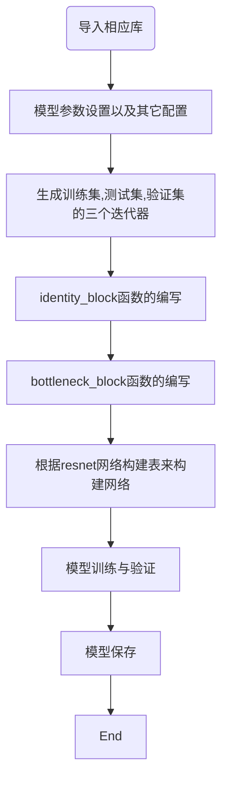

#  卷积cnn
## 卷积神经网络基础知识
### cnn卷积后输出矩阵的大小：
$$ N = (W − F + 2P )/S+1 $$
其中，输入图片大小 W×W，Filter大小 F×F，步长 S，padding的像素数 P。

### 池化层

卷积网络也经常使用池化层来缩减模型的大小，提高计算速度，同时提高所提取特征的鲁棒性(防止过拟合)。

$$ pool \{Maxpool;Avepool\} $$

### Leaky ReLU

为了缓解“死区”现象，其中 α 为0.01 或 0.001 数量级的较小正数。由于 α 为超参数，合适的值较难设
定且较为敏感，因此 该函数在实际使用中的性能并不十分稳定。  

$ Leaky\ ReLU(x)=\left\{
\begin{aligned}
x \ ,if\ x>0 \\
\alpha \cdot x \ ,if \ x<0
\end{aligned}
\right.$

### LRN局部响应归一化
$b^{i}_{(x, y)} = \frac{a^{i}_{(x, y)}}{(k + \alpha \sum\limits_{j = max(0, i - n / 2)}^{min(N-1, i+n / 2)}(a^j_{(x, y)})^2)^{\beta}}$

 $a^i_{(x, y)}$代表的是ReLU在第i个kernel的(x, y)位置的输出，n表示的是$a^i_{(x, y)}d$的邻居个数，N表示该kernel的总数量，$b^i_{(x,y)}$表示LPN结果。
### FancyPCA(数据扩充方法)

对所有训练数据的RGB像素值进行PCA，得到对应的特征向量 $ p_i $和特征值 $λ_i$ {i = 1, 2, 3}，然后根据特征向量和特征值可以计算一组随机值 $[p_1, p_2, p_3] [α_1λ_1, α_2λ_2, α_3λ_3]^⊤$，将其作为扰动加到原像素值中。其中， $α_i$ 为取自以 y 为均值，标准差为 0.1的高斯分布的随机值。在每经过一轮训练（一个 epoch）后， $α_i $将重新随机选取并重复上述操作对原像素值进行扰动。 

### 随机梯度下降法

$\omega_t=\omega_{t-1}-\eta \cdot g$

### 动量梯度下降法

$ v_t =\mu \cdot v_{t-1}-\eta \cdot g$

$\omega =\omega_{t-1}+v_t$

### Nesterov型动量随机下降法

$ \omega_{ahead}=\omega_{t-1} +\mu \cdot v_{t-1}$

$ v_t =\mu \cdot v_{t-1}-\eta \cdot \Delta \omega_{ahead}$

$\omega =\omega_{t-1}+v_t$

## 卷积神经网络结构

### Alexnet

****


```python
# -*- coding:utf-8 -*-
"""
@author:wood-water-duck
@file:alexNet.py
@function:实现Alexnet深度模型
@time:2019 05.23
"""
 
import tensorflow as tf
import time
import math
from datetime import datetime
 
batch_size=32
num_batch=100
keep_prob=0.5
 
 
def print_architecture(t):
    """print the architecture information of the network,include name and size"""
    print(t.op.name," ",t.get_shape().as_list())
 
 
def inference(images):
    """ 构建网络 ：5个conv+3个FC"""
    parameters=[]  #储存参数
 
    with tf.name_scope('conv1') as scope:
        """
        images:227*227*3
        kernel: 11*11 *64
        stride:4*4
        padding:name      
        
        #通过with tf.name_scope('conv1') as scope可以将scope内生成的Variable自动命名为conv1/xxx
        便于区分不同卷积层的组建
        
        input: images[227*227*3]
        middle: conv1[55*55*96]
        output: pool1 [27*27*96]
        
        """
        kernel=tf.Variable(tf.truncated_normal([11,11,3,96],
                           dtype=tf.float32,stddev=0.1),name="weights")
        conv=tf.nn.conv2d(images,kernel,[1,4,4,1],padding='SAME')
        biases=tf.Variable(tf.constant(0.0, shape=[96],  dtype=tf.float32),
                           trainable=True,name="biases")
        bias=tf.nn.bias_add(conv,biases) # w*x+b
        conv1=tf.nn.relu(bias,name=scope) # reLu
        print_architecture(conv1)
        parameters +=[kernel,biases]
 
        #添加LRN层和max_pool层
        """
        LRN会让前馈、反馈的速度大大降低（下降1/3），但最终效果不明显，所以只有ALEXNET用LRN
        """
        lrn1=tf.nn.lrn(conv1,depth_radius=4,bias=1,alpha=0.001/9,beta=0.75,name="lrn1")
        pool1=tf.nn.max_pool(lrn1,ksize=[1,3,3,1],strides=[1,2,2,1],
                             padding="VALID",name="pool1")
        print_architecture(pool1)
 
    with tf.name_scope('conv2') as scope:
        """
        input: pool1[27*27*96]
        middle: conv2[27*27*256]
        output: pool2 [13*13*256]
 
        """
        kernel = tf.Variable(tf.truncated_normal([5, 5, 96, 256],
                                                 dtype=tf.float32, stddev=0.1), name="weights")
        conv = tf.nn.conv2d(pool1, kernel, [1, 1, 1, 1], padding='SAME')
        biases = tf.Variable(tf.constant(0.0, shape=[256], dtype=tf.float32),
                             trainable=True, name="biases")
        bias = tf.nn.bias_add(conv, biases)  # w*x+b
        conv2 = tf.nn.relu(bias, name=scope)  # reLu
        parameters += [kernel, biases]
        # 添加LRN层和max_pool层
        """
        LRN会让前馈、反馈的速度大大降低（下降1/3），但最终效果不明显，所以只有ALEXNET用LRN
        """
        lrn2 = tf.nn.lrn(conv2, depth_radius=4, bias=1, alpha=0.001 / 9, beta=0.75, name="lrn1")
        pool2 = tf.nn.max_pool(lrn2, ksize=[1, 3, 3, 1], strides=[1, 2, 2, 1],
                               padding="VALID", name="pool2")
        print_architecture(pool2)
 
    with tf.name_scope('conv3') as scope:
        """
        input: pool2[13*13*256]
        output: conv3 [13*13*384]
 
        """
        kernel = tf.Variable(tf.truncated_normal([3, 3, 256, 384],
                                                 dtype=tf.float32, stddev=0.1), name="weights")
        conv = tf.nn.conv2d(pool2, kernel, [1, 1, 1, 1], padding='SAME')
        biases = tf.Variable(tf.constant(0.0, shape=[384], dtype=tf.float32),
                             trainable=True, name="biases")
        bias = tf.nn.bias_add(conv, biases)  # w*x+b
        conv3 = tf.nn.relu(bias, name=scope)  # reLu
        parameters += [kernel, biases]
        print_architecture(conv3)
 
    with tf.name_scope('conv4') as scope:
        """
        input: conv3[13*13*384]
        output: conv4 [13*13*384]
 
        """
        kernel = tf.Variable(tf.truncated_normal([3, 3, 384, 384],
                                                 dtype=tf.float32, stddev=0.1), name="weights")
        conv = tf.nn.conv2d(conv3, kernel, [1, 1, 1, 1], padding='SAME')
        biases = tf.Variable(tf.constant(0.0, shape=[384], dtype=tf.float32),
                             trainable=True, name="biases")
        bias = tf.nn.bias_add(conv, biases)  # w*x+b
        conv4 = tf.nn.relu(bias, name=scope)  # reLu
        parameters += [kernel, biases]
        print_architecture(conv4)
 
    with tf.name_scope('conv5') as scope:
        """
        input: conv4[13*13*384]
        output: conv5 [6*6*256]
 
        """
        kernel = tf.Variable(tf.truncated_normal([3, 3, 384, 256],
                                                 dtype=tf.float32, stddev=0.1), name="weights")
        conv = tf.nn.conv2d(conv4, kernel, [1, 1, 1, 1], padding='SAME')
        biases = tf.Variable(tf.constant(0.0, shape=[256], dtype=tf.float32),
                             trainable=True, name="biases")
        bias = tf.nn.bias_add(conv, biases)  # w*x+b
        conv5 = tf.nn.relu(bias, name=scope)  # reLu
        pool5 = tf.nn.max_pool(conv5, ksize=[1, 3, 3, 1], strides=[1, 2, 2, 1],
                               padding="VALID", name="pool5")
        parameters += [kernel, biases]
        print_architecture(pool5)
 
    #全连接层6
    with tf.name_scope('fc6') as scope:
        """
        input:pool5 [6*6*256]
        output:fc6 [4096]
        """
        kernel = tf.Variable(tf.truncated_normal([6*6*256,4096],
                                                 dtype=tf.float32, stddev=0.1), name="weights")
        biases = tf.Variable(tf.constant(0.0, shape=[4096], dtype=tf.float32),
                             trainable=True, name="biases")
        # 输入数据变换
        flat = tf.reshape(pool5, [-1, 6*6*256] )  # 整形成m*n,列n为7*7*64
        # 进行全连接操作
        fc = tf.nn.relu(tf.matmul(flat, kernel) + biases,name='fc6')
        # 防止过拟合  nn.dropout
        fc6 = tf.nn.dropout(fc, keep_prob)
        parameters += [kernel, biases]
        print_architecture(fc6)
 
    # 全连接层7
    with tf.name_scope('fc7') as scope:
        """
        input:fc6 [4096]
        output:fc7 [4096]
        """
        kernel = tf.Variable(tf.truncated_normal([4096, 4096],
                                                 dtype=tf.float32, stddev=0.1), name="weights")
        biases = tf.Variable(tf.constant(0.0, shape=[4096], dtype=tf.float32),
                             trainable=True, name="biases")
        # 进行全连接操作
        fc = tf.nn.relu(tf.matmul(fc6, kernel) + biases, name='fc7')
        # 防止过拟合  nn.dropout
        fc7 = tf.nn.dropout(fc, keep_prob)
        parameters += [kernel, biases]
        print_architecture(fc7)
 
    # 全连接层8
    with tf.name_scope('fc8') as scope:
        """
        input:fc7 [4096]
        output:fc8 [1000]
        """
        kernel = tf.Variable(tf.truncated_normal([4096, 1000],
                                                 dtype=tf.float32, stddev=0.1), name="weights")
        biases = tf.Variable(tf.constant(0.0, shape=[1000], dtype=tf.float32),
                             trainable=True, name="biases")
        # 进行全连接操作
        fc8 = tf.nn.xw_plus_b(fc7, kernel, biases, name='fc8')
        parameters += [kernel, biases]
        print_architecture(fc8)
 
    return fc8,parameters
 
def time_compute(session,target,info_string):
    num_step_burn_in=10  #预热轮数，头几轮迭代有显存加载、cache命中等问题可以因此跳过
    total_duration=0.0   #总时间
    total_duration_squared=0.0
    for i in range(num_batch+num_step_burn_in):
        start_time=time.time()
        _ = session.run(target)
        duration= time.time() -start_time
        if i>= num_step_burn_in:
            if i%10==0: #每迭代10次显示一次duration
                print("%s: step %d,duration=%.5f "% (datetime.now(),i-num_step_burn_in,duration))
            total_duration += duration
            total_duration_squared += duration *duration
    time_mean=total_duration /num_batch
    time_variance=total_duration_squared / num_batch - time_mean*time_mean
    time_stddev=math.sqrt(time_variance)
    #迭代完成，输出
    print("%s: %s across %d steps,%.3f +/- %.3f sec per batch "%
              (datetime.now(),info_string,num_batch,time_mean,time_stddev))
 
def main():
    with tf.Graph().as_default():
        """仅使用随机图片数据 测试前馈和反馈计算的耗时"""
        image_size =224
        images=tf.Variable(tf.random_normal([batch_size,image_size,image_size,3],
                                     dtype=tf.float32,stddev=0.1 ) )
        fc8,parameters=inference(images)
 
        init=tf.global_variables_initializer()
        sess=tf.Session()
        sess.run(init)
 
        """
        AlexNet forward 计算的测评
        传入的target:fc8（即最后一层的输出）
        优化目标：loss
        使用tf.gradients求相对于loss的所有模型参数的梯度
        
        
        AlexNet Backward 计算的测评
        target:grad
         
        """
        time_compute(sess,target=fc8,info_string="Forward")
 
        obj=tf.nn.l2_loss(fc8)
        grad=tf.gradients(obj,parameters)
        time_compute(sess,grad,"Forward-backward")
 
 
if __name__=="__main__":
    main()

```

### vggnet


Vgg16:

1、输入224x224x3的图片，经64个3x3的卷积核作两次卷积+ReLU，卷积后的尺寸变为224x224x64
2、作max pooling（最大化池化），池化单元尺寸为2x2（效果为图像尺寸减半），池化后的尺寸变为112x112x64
3、经128个3x3的卷积核作两次卷积+ReLU，尺寸变为112x112x128
4、作2x2的max pooling池化，尺寸变为56x56x128
5、经256个3x3的卷积核作三次卷积+ReLU，尺寸变为56x56x256
6、作2x2的max pooling池化，尺寸变为28x28x256
7、经512个3x3的卷积核作三次卷积+ReLU，尺寸变为28x28x512
8、作2x2的max pooling池化，尺寸变为14x14x512
9、经512个3x3的卷积核作三次卷积+ReLU，尺寸变为14x14x512
10、作2x2的max pooling池化，尺寸变为7x7x512
11、与两层1x1x4096，一层1x1x1000进行全连接+ReLU（共三层）
12、通过softmax输出1000个预测结果

Vgg16:

```python
# -*- coding:utf-8 -*-
"""
@author:wood-water-duck
@file:alexNet.py
@function:实现Vggnet16深度模型
@time:2019 05.23
"""
from keras.layers import Input
from keras.layers import Conv2D, MaxPool2D, Dense, Flatten, Dropout
from keras.models import Model
from keras import optimizers
from keras.utils import plot_model
 
 
def vgg13(input_shape=(224,224,3), nclass=1000):
    """
    build vgg13 model using keras with TensorFlow backend.
    :param input_shape: input shape of network, default as (224,224,3)
    :param nclass: numbers of class(output shape of network), default as 1000
    :return: vgg13 model
    """
    input_ = Input(shape=input_shape)
 
    x = Conv2D(64, kernel_size=(3, 3), strides=(1, 1), padding='same', activation='relu')(input_)
    x = Conv2D(64, kernel_size=(3, 3), strides=(1, 1), padding='same', activation='relu')(x)
    x = MaxPool2D(pool_size=(2, 2), strides=(2, 2), padding='same')(x)
 
    x = Conv2D(128, kernel_size=(3, 3), strides=(1, 1), padding='same', activation='relu')(x)
    x = Conv2D(128, kernel_size=(3, 3), strides=(1, 1), padding='same', activation='relu')(x)
    x = MaxPool2D(pool_size=(2, 2), strides=(2, 2), padding='same')(x)
 
    x = Conv2D(256, kernel_size=(3, 3), strides=(1, 1), padding='same', activation='relu')(x)
    x = Conv2D(256, kernel_size=(3, 3), strides=(1, 1), padding='same', activation='relu')(x)
    x = MaxPool2D(pool_size=(2, 2), strides=(2, 2), padding='same')(x)
 
    x = Conv2D(512, kernel_size=(3, 3), strides=(1, 1), padding='same', activation='relu')(x)
    x = Conv2D(512, kernel_size=(3, 3), strides=(1, 1), padding='same', activation='relu')(x)
    x = MaxPool2D(pool_size=(2, 2), strides=(2, 2), padding='same')(x)
 
    x = Conv2D(512, kernel_size=(3, 3), strides=(1, 1), padding='same', activation='relu')(x)
    x = Conv2D(512, kernel_size=(3, 3), strides=(1, 1), padding='same', activation='relu')(x)
    x = MaxPool2D(pool_size=(2, 2), strides=(2, 2), padding='same')(x)
 
    x = Flatten()(x)
    x = Dense(4096, activation='relu')(x)
    x = Dropout(0.5)(x)
    x = Dense(4096, activation='relu')(x)
    x = Dropout(0.5)(x)
    output_ = Dense(nclass, activation='softmax')(x)
 
    model = Model(inputs=input_, outputs=output_)
    model.summary()
 
    opti_sgd = optimizers.sgd(lr=0.01, momentum=0.9, nesterov=True)
 
    model.compile(loss='categorical_crossentropy', optimizer=opti_sgd, metrics=['accuracy'])
 
    return model
 
if __name__ == '__main__':
    model = vgg13()
    plot_model(model, 'vgg13.png')  # 保存模型图
```

### Googlenet

Inception V1：

****

Inception V4:结合res

****

V1：

```python

# -*- coding:utf-8 -*-
"""
@author:wood-water-duck
@file:alexNet.py
@function:实现GooglenetV1深度模型
@time:2019 05.23
"""
from keras.models import Model
from keras.layers import Input,Dense,Dropout,BatchNormalization,Conv2D,MaxPooling2D,AveragePooling2D,concatenate
from keras.layers.convolutional import Conv2D,MaxPooling2D,AveragePooling2D
import numpy as np
seed = 7
np.random.seed(seed)
 
def Conv2d_BN(x, nb_filter,kernel_size, padding='same',strides=(1,1),name=None):
    if name is not None:
        bn_name = name + '_bn'
        conv_name = name + '_conv'
    else:
        bn_name = None
        conv_name = None
 
    x = Conv2D(nb_filter,kernel_size,padding=padding,strides=strides,activation='relu',name=conv_name)(x)
    x = BatchNormalization(axis=3,name=bn_name)(x)
    return x
 
def Inception(x,nb_filter):
    branch1x1 = Conv2d_BN(x,nb_filter,(1,1), padding='same',strides=(1,1),name=None)
 
    branch3x3 = Conv2d_BN(x,nb_filter,(1,1), padding='same',strides=(1,1),name=None)
    branch3x3 = Conv2d_BN(branch3x3,nb_filter,(3,3), padding='same',strides=(1,1),name=None)
 
    branch5x5 = Conv2d_BN(x,nb_filter,(1,1), padding='same',strides=(1,1),name=None)
    branch5x5 = Conv2d_BN(branch5x5,nb_filter,(1,1), padding='same',strides=(1,1),name=None)
 
    branchpool = MaxPooling2D(pool_size=(3,3),strides=(1,1),padding='same')(x)
    branchpool = Conv2d_BN(branchpool,nb_filter,(1,1),padding='same',strides=(1,1),name=None)
 
    x = concatenate([branch1x1,branch3x3,branch5x5,branchpool],axis=3)
 
    return x
 
inpt = Input(shape=(224,224,3))
#padding = 'same'，填充为(步长-1）/2,还可以用ZeroPadding2D((3,3))
x = Conv2d_BN(inpt,64,(7,7),strides=(2,2),padding='same')
x = MaxPooling2D(pool_size=(3,3),strides=(2,2),padding='same')(x)
x = Conv2d_BN(x,192,(3,3),strides=(1,1),padding='same')
x = MaxPooling2D(pool_size=(3,3),strides=(2,2),padding='same')(x)
x = Inception(x,64)#256
x = Inception(x,120)#480
x = MaxPooling2D(pool_size=(3,3),strides=(2,2),padding='same')(x)
x = Inception(x,128)#512
x = Inception(x,128)
x = Inception(x,128)
x = Inception(x,132)#528
x = Inception(x,208)#832
x = MaxPooling2D(pool_size=(3,3),strides=(2,2),padding='same')(x)
x = Inception(x,208)
x = Inception(x,256)#1024
x = AveragePooling2D(pool_size=(7,7),strides=(7,7),padding='same')(x)
x = Dropout(0.4)(x)
x = Dense(1000,activation='relu')(x)
x = Dense(1000,activation='softmax')(x)
model = Model(inpt,x,name='inception')
model.compile(loss='categorical_crossentropy',optimizer='sgd',metrics=['accuracy'])
model.summary()
```

### Resnet


****





```python
# -*- coding:utf-8 -*-
"""
@author:wood-water-duck
@file:alexNet.py
@function:实现Resnet深度模型
@time:2019 05.23
"""
from keras.models import Model
from keras.layers import Input, Dense, Dropout, BatchNormalization, Conv2D, MaxPooling2D,
\AveragePooling2D, concatenate,Activation, ZeroPadding2D
from keras.layers import add, Flatten
from keras.utils import plot_model
from keras.metrics import top_k_categorical_accuracy
from keras.preprocessing.image import ImageDataGenerator
from keras.models import load_model
import os

# Global Constants
NB_CLASS=20
IM_WIDTH=224
IM_HEIGHT=224
train_root='/home/faith/keras/dataset/traindata/'
vaildation_root='/home/faith/keras/dataset/vaildationdata/'
test_root='/home/faith/keras/dataset/testdata/'
batch_size=32
EPOCH=60

# train data
train_datagen = ImageDataGenerator(
    width_shift_range=0.1,
    height_shift_range=0.1,
    shear_range=0.1,
    zoom_range=0.1,
    horizontal_flip=True,
    rescale=1./255
)
train_generator = train_datagen.flow_from_directory(
    train_root,
    target_size=(IM_WIDTH, IM_HEIGHT),
    batch_size=batch_size,
    shuffle=True
)

# vaild data
vaild_datagen = ImageDataGenerator(
    width_shift_range=0.1,
    height_shift_range=0.1,
    shear_range=0.1,
    zoom_range=0.1,
    horizontal_flip=True,
    rescale=1./255
)
vaild_generator = train_datagen.flow_from_directory(
    vaildation_root,
    target_size=(IM_WIDTH, IM_HEIGHT),
    batch_size=batch_size,
)

# test data
test_datagen = ImageDataGenerator(
    rescale=1./255
)
test_generator = train_datagen.flow_from_directory(
    test_root,
    target_size=(IM_WIDTH, IM_HEIGHT),
    batch_size=batch_size,
)

def Conv2d_BN(x, nb_filter, kernel_size, strides=(1, 1), padding='same', name=None):
    if name is not None:
        bn_name = name + '_bn'
        conv_name = name + '_conv'
    else:
        bn_name = None
        conv_name = None

    x = Conv2D(nb_filter, kernel_size, padding=padding, strides=strides, activation='relu', name=conv_name)(x)
    x = BatchNormalization(axis=3, name=bn_name)(x)
    return x


def identity_Block(inpt, nb_filter, kernel_size, strides=(1, 1), with_conv_shortcut=False):#res34
    x = Conv2d_BN(inpt, nb_filter=nb_filter, kernel_size=kernel_size, strides=strides, padding='same')
    x = Conv2d_BN(x, nb_filter=nb_filter, kernel_size=kernel_size, padding='same')
    if with_conv_shortcut:
        shortcut = Conv2d_BN(inpt, nb_filter=nb_filter, strides=strides, kernel_size=kernel_size)
        x = add([x, shortcut])
        return x
    else:
        x = add([x, inpt])
        return x

def bottleneck_Block(inpt,nb_filters,strides=(1,1),with_conv_shortcut=False):#res50
    k1,k2,k3=nb_filters
    x = Conv2d_BN(inpt, nb_filter=k1, kernel_size=1, strides=strides, padding='same')
    x = Conv2d_BN(x, nb_filter=k2, kernel_size=3, padding='same')
    x = Conv2d_BN(x, nb_filter=k3, kernel_size=1, padding='same')
    if with_conv_shortcut:
        shortcut = Conv2d_BN(inpt, nb_filter=k3, strides=strides, kernel_size=1)
        x = add([x, shortcut])
        return x
    else:
        x = add([x, inpt])
        return x

def resnet_34(width,height,channel,classes):
    inpt = Input(shape=(width, height, channel))
    x = ZeroPadding2D((3, 3))(inpt)

    #conv1
    x = Conv2d_BN(x, nb_filter=64, kernel_size=(7, 7), strides=(2, 2), padding='valid')
    x = MaxPooling2D(pool_size=(3, 3), strides=(2, 2), padding='same')(x)

    #conv2_x
    x = identity_Block(x, nb_filter=64, kernel_size=(3, 3))
    x = identity_Block(x, nb_filter=64, kernel_size=(3, 3))
    x = identity_Block(x, nb_filter=64, kernel_size=(3, 3))

    #conv3_x
    x = identity_Block(x, nb_filter=128, kernel_size=(3, 3), strides=(2, 2), with_conv_shortcut=True)
    x = identity_Block(x, nb_filter=128, kernel_size=(3, 3))
    x = identity_Block(x, nb_filter=128, kernel_size=(3, 3))
    x = identity_Block(x, nb_filter=128, kernel_size=(3, 3))

    #conv4_x
    x = identity_Block(x, nb_filter=256, kernel_size=(3, 3), strides=(2, 2), with_conv_shortcut=True)
    x = identity_Block(x, nb_filter=256, kernel_size=(3, 3))
    x = identity_Block(x, nb_filter=256, kernel_size=(3, 3))
    x = identity_Block(x, nb_filter=256, kernel_size=(3, 3))
    x = identity_Block(x, nb_filter=256, kernel_size=(3, 3))
    x = identity_Block(x, nb_filter=256, kernel_size=(3, 3))

    #conv5_x
    x = identity_Block(x, nb_filter=512, kernel_size=(3, 3), strides=(2, 2), with_conv_shortcut=True)
    x = identity_Block(x, nb_filter=512, kernel_size=(3, 3))
    x = identity_Block(x, nb_filter=512, kernel_size=(3, 3))
    x = AveragePooling2D(pool_size=(7, 7))(x)
    x = Flatten()(x)
    x = Dense(classes, activation='softmax')(x)

    model = Model(inputs=inpt, outputs=x)
    return model

def resnet_50(width,height,channel,classes):
    inpt = Input(shape=(width, height, channel))
    x = ZeroPadding2D((3, 3))(inpt)
    x = Conv2d_BN(x, nb_filter=64, kernel_size=(7, 7), strides=(2, 2), padding='valid')
    x = MaxPooling2D(pool_size=(3, 3), strides=(2, 2), padding='same')(x)

    #conv2_x
    x = bottleneck_Block(x, nb_filters=[64,64,256],strides=(1,1),with_conv_shortcut=True)
    x = bottleneck_Block(x, nb_filters=[64,64,256])
    x = bottleneck_Block(x, nb_filters=[64,64,256])

    #conv3_x
    x = bottleneck_Block(x, nb_filters=[128, 128, 512],strides=(2,2),with_conv_shortcut=True)
    x = bottleneck_Block(x, nb_filters=[128, 128, 512])
    x = bottleneck_Block(x, nb_filters=[128, 128, 512])
    x = bottleneck_Block(x, nb_filters=[128, 128, 512])

    #conv4_x
    x = bottleneck_Block(x, nb_filters=[256, 256, 1024],strides=(2,2),with_conv_shortcut=True)
    x = bottleneck_Block(x, nb_filters=[256, 256, 1024])
    x = bottleneck_Block(x, nb_filters=[256, 256, 1024])
    x = bottleneck_Block(x, nb_filters=[256, 256, 1024])
    x = bottleneck_Block(x, nb_filters=[256, 256, 1024])
    x = bottleneck_Block(x, nb_filters=[256, 256, 1024])

    #conv5_x
    x = bottleneck_Block(x, nb_filters=[512, 512, 2048], strides=(2, 2), with_conv_shortcut=True)
    x = bottleneck_Block(x, nb_filters=[512, 512, 2048])
    x = bottleneck_Block(x, nb_filters=[512, 512, 2048])

    x = AveragePooling2D(pool_size=(7, 7))(x)
    x = Flatten()(x)
    x = Dense(classes, activation='softmax')(x)

    model = Model(inputs=inpt, outputs=x)
    return model

def acc_top2(y_true, y_pred):
    return top_k_categorical_accuracy(y_true, y_pred, k=2)


def check_print():
    # Create a Keras Model
    model = resnet_50(IM_WIDTH,IM_HEIGHT,3,NB_CLASS)
    model.summary()
    # Save a PNG of the Model Build
    plot_model(model, to_file='resnet.png')
    model.compile(optimizer='adam', loss='categorical_crossentropy', metrics=['acc',top_k_categorical_accuracy])
    print 'Model Compiled'
    return model


if __name__ == '__main__':
    if os.path.exists('resnet_50.h5'):
        model=load_model('resnet_50.h5')
    else:
        model=check_print()

    model.fit_generator(train_generator,validation_data=vaild_generator,epochs=EPOCH,steps_per_epoch=train_generator.n/batch_size
                        ,validation_steps=vaild_generator.n/batch_size)
    model.save('resnet_50.h5')
    loss,acc,top_acc=model.evaluate_generator(test_generator, steps=test_generator.n / batch_size)
    print 'Test result:loss:%f,acc:%f,top_acc:%f' % (loss, acc, top_acc)

```

### Densenet

特点：

1、减轻了vanishing-gradient（梯度消失）
2、加强了feature的传递
3、更有效地利用了feature
4、一定程度上减少了参数数量

****

```python
from keras.models import Model
from keras.layers.core import Dense, Dropout, Activation
from keras.layers.convolutional import Convolution2D
from keras.layers.pooling import AveragePooling2D
from keras.layers.pooling import GlobalAveragePooling2D
from keras.layers import Input
from keras.layers.merge import Concatenate
from keras.layers.normalization import BatchNormalization
from keras.regularizers import l2
import keras.backend as K

def conv_block(input, nb_filter, dropout_rate=None, weight_decay=1E-4):
    ''' Apply BatchNorm, Relu 3x3, Conv2D, optional dropout
    Args:
        input: Input keras tensor
        nb_filter: number of filters
        dropout_rate: dropout rate
        weight_decay: weight decay factor
    Returns: keras tensor with batch_norm, relu and convolution2d added
    '''

    x = Activation('relu')(input)
    x = Convolution2D(nb_filter, (3, 3), kernel_initializer="he_uniform", padding="same", use_bias=False,
                      kernel_regularizer=l2(weight_decay))(x)
    if dropout_rate is not None:
        x = Dropout(dropout_rate)(x)

    return x


def transition_block(input, nb_filter, dropout_rate=None, weight_decay=1E-4):
    ''' Apply BatchNorm, Relu 1x1, Conv2D, optional dropout and Maxpooling2D
    Args:
        input: keras tensor
        nb_filter: number of filters
        dropout_rate: dropout rate
        weight_decay: weight decay factor
    Returns: keras tensor, after applying batch_norm, relu-conv, dropout, maxpool
    '''

    concat_axis = 1 if K.image_dim_ordering() == "th" else -1

    x = Convolution2D(nb_filter, (1, 1), kernel_initializer="he_uniform", padding="same", use_bias=False,
                      kernel_regularizer=l2(weight_decay))(input)
    if dropout_rate is not None:
        x = Dropout(dropout_rate)(x)
    x = AveragePooling2D((2, 2), strides=(2, 2))(x)

    x = BatchNormalization(axis=concat_axis, gamma_regularizer=l2(weight_decay),
                           beta_regularizer=l2(weight_decay))(x)

    return x


def dense_block(x, nb_layers, nb_filter, growth_rate, dropout_rate=None, weight_decay=1E-4):
    ''' Build a dense_block where the output of each conv_block is fed to subsequent ones
    Args:
        x: keras tensor
        nb_layers: the number of layers of conv_block to append to the model.
        nb_filter: number of filters
        growth_rate: growth rate
        dropout_rate: dropout rate
        weight_decay: weight decay factor
    Returns: keras tensor with nb_layers of conv_block appended
    '''

    concat_axis = 1 if K.image_dim_ordering() == "th" else -1

    feature_list = [x]

    for i in range(nb_layers):
        x = conv_block(x, growth_rate, dropout_rate, weight_decay)
        feature_list.append(x)
        x = Concatenate(axis=concat_axis)(feature_list)
        nb_filter += growth_rate

    return x, nb_filter


def createDenseNet(nb_classes, img_dim, depth=40, nb_dense_block=3, growth_rate=12, nb_filter=16, dropout_rate=None,
                     weight_decay=1E-4, verbose=True):
    ''' Build the create_dense_net model
    Args:
        nb_classes: number of classes
        img_dim: tuple of shape (channels, rows, columns) or (rows, columns, channels)
        depth: number or layers
        nb_dense_block: number of dense blocks to add to end
        growth_rate: number of filters to add
        nb_filter: number of filters
        dropout_rate: dropout rate
        weight_decay: weight decay
    Returns: keras tensor with nb_layers of conv_block appended
    '''

    model_input = Input(shape=img_dim)

    concat_axis = 1 if K.image_dim_ordering() == "th" else -1

    assert (depth - 4) % 3 == 0, "Depth must be 3 N + 4"

    # layers in each dense block
    nb_layers = int((depth - 4) / 3)

    # Initial convolution
    x = Convolution2D(nb_filter, (3, 3), kernel_initializer="he_uniform", padding="same", name="initial_conv2D", use_bias=False,
                      kernel_regularizer=l2(weight_decay))(model_input)

    x = BatchNormalization(axis=concat_axis, gamma_regularizer=l2(weight_decay),
                            beta_regularizer=l2(weight_decay))(x)

    # Add dense blocks
    for block_idx in range(nb_dense_block - 1):
        x, nb_filter = dense_block(x, nb_layers, nb_filter, growth_rate, dropout_rate=dropout_rate,
                                   weight_decay=weight_decay)
        # add transition_block
        x = transition_block(x, nb_filter, dropout_rate=dropout_rate, weight_decay=weight_decay)

    # The last dense_block does not have a transition_block
    x, nb_filter = dense_block(x, nb_layers, nb_filter, growth_rate, dropout_rate=dropout_rate,
                               weight_decay=weight_decay)

    x = Activation('relu')(x)
    x = GlobalAveragePooling2D()(x)
    x = Dense(nb_classes, activation='softmax', kernel_regularizer=l2(weight_decay), bias_regularizer=l2(weight_decay))(x)

    densenet = Model(inputs=model_input, outputs=x)

    if verbose: 
        print("DenseNet-%d-%d created." % (depth, growth_rate))

    return densenet
```

